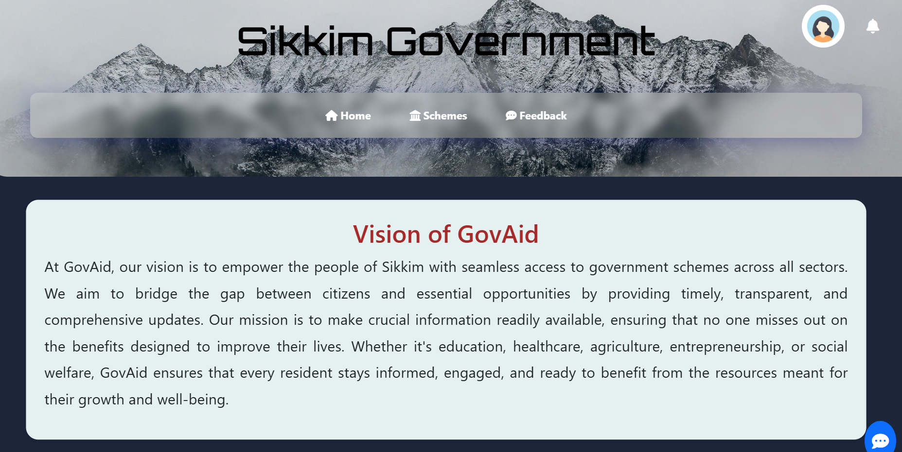
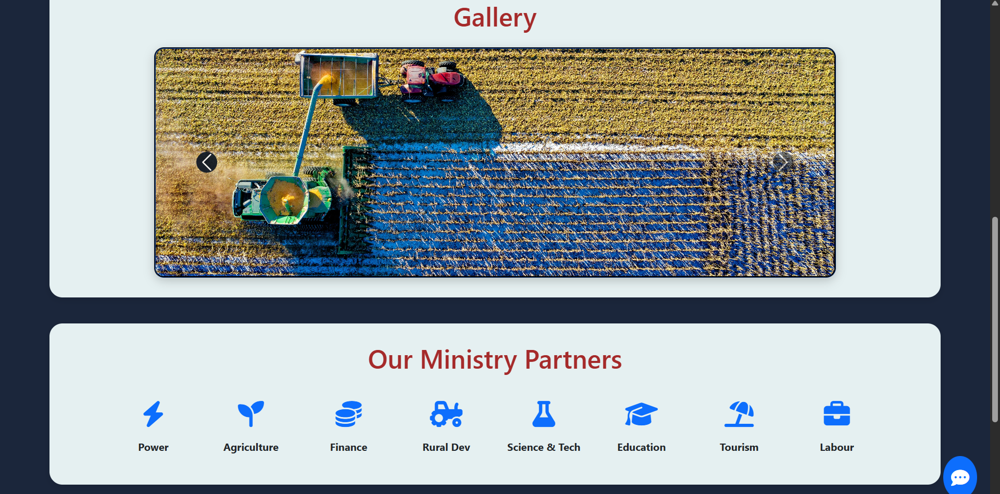
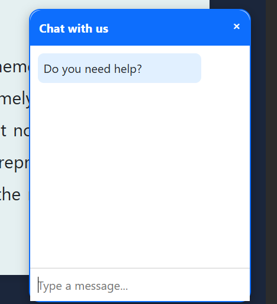

<div align="center">

# 🏛️ GovAid – Government Schemes Portal for Sikkim

### A Modern, Feature-Rich Platform for Discovering & Accessing Government Schemes

[](https://www.djangoproject.com/)
[](https://tailwindcss.com/)
[](https://www.python.org/)
[](https://www.sqlite.org/)

**🏆 Originally Developed for SummitSikkim 2025 Hackathon | Now Feature-Complete**

[Features](#-key-features) • [Tech Stack](#-tech-stack) • [Installation](#-installation--setup) • [Usage](#-usage) • [API](#-project-structure) • [Contributing](#-future-enhancements)

</div>

---

## 📖 Overview

**GovAid** is a comprehensive, modern web application designed to bridge the gap between citizens and government welfare schemes in Sikkim. Built with Django and styled with Tailwind CSS, it provides an intuitive, accessible platform for discovering, comparing, and applying to government schemes.

### 🎯 Mission

Empower Sikkim's citizens by providing:

- **Centralized Access** to 25+ government schemes across 10 categories
- **Smart Eligibility Matching** using user profiles and intelligent filters
- **Real-Time Notifications** for application updates and new schemes
- **Modern UX/UI** with dark mode, mobile responsiveness, and accessibility

### 🌟 Why GovAid?

- **User-Centric Design**: Built for citizens of all ages and technical backgrounds
- **Comprehensive Coverage**: Education, Health, Agriculture, Business, Social Welfare, and more
- **Privacy First**: Secure data handling with encrypted sensitive information (Aadhaar)
- **Fully Responsive**: Works seamlessly on desktop, tablet, and mobile devices
- **Dark Mode Support**: Comfortable viewing in any lighting condition

---

## ✨ Key Features

### 🔍 Core Functionality

- **🗂️ Scheme Directory** – Browse 25+ government schemes organized by 10 categories
- **🎯 Smart Eligibility Checker** – AI-powered matching based on user profile (age, income, location, caste, etc.)
- **📋 Application Management** – Submit applications and track status in real-time
- **🔔 Notification Center** – Stay updated with application status changes and scheme announcements

### 🚀 Advanced Features

- **✨ Smart Personalized Recommendations** – AI-powered scheme suggestions based on user profile with match percentage scoring
- **🔎 Advanced Search** – Multi-criteria filtering (category, age, income, location, caste, disability, minority, BPL)
- **⚖️ Enhanced Scheme Comparison Tool** – Compare up to 5 schemes side-by-side with analytics insights and eligibility metrics
- **📊 Comparison Analytics Dashboard** – Detailed eligibility scorecard, income analysis, and smart recommendations
- **❤️ Favorites/Bookmarks** – Save schemes for quick access later
- **📊 Application Timeline** – Visual timeline tracking application progress and status changes
- **💬 Feedback System** – Submit feedback and receive replies from administrators

### 🎨 Design & UX Excellence

- **🌓 Enhanced Dark/Light Mode** – Optimized color schemes for both themes with improved contrast and readability
- **📱 Mobile-First Responsive Design** – Touch-optimized interface with 44px+ touch targets for all devices
- **♿ Accessibility** – WCAG compliant with screen reader support and keyboard navigation
- **✨ Smooth Animations** – Professional entrance animations (fade-in, slide-up) with stagger delays
- **🎯 Hover Effects** – Interactive lift animations on cards and buttons
- **⚡ Fast Performance** – Optimized assets with CSS and JS compression

### 🛡️ Security & Privacy

- **🔐 Encrypted Data Storage** – Aadhaar numbers encrypted using Fernet encryption
- **👥 Role-Based Access Control** – Separate interfaces for citizens, employees, and admins
- **🔒 Secure Authentication** – Django's built-in auth with CSRF protection

---

## 🖥️ Tech Stack

### Backend

| Technology       | Version | Purpose                              |
| ---------------- | ------- | ------------------------------------ |
| **Django**       | 5.2.1   | Web framework & ORM                  |
| **Python**       | 3.13    | Programming language                 |
| **SQLite**       | 3.x     | Development database                 |
| **Cryptography** | Latest  | Fernet encryption for sensitive data |

### Frontend

| Technology                 | Version | Purpose                          |
| -------------------------- | ------- | -------------------------------- |
| **Tailwind CSS**           | 3.4.1   | Utility-first CSS framework      |
| **Font Awesome**           | 6.x     | Icon library                     |
| **JavaScript (Vanilla)**   | ES6+    | Interactive features & dark mode |
| **Inter & Orbitron Fonts** | -       | Typography                       |

### Development Tools

| Tool       | Purpose                         |
| ---------- | ------------------------------- |
| **npm**    | Package management & CSS builds |
| **Pipenv** | Python dependency management    |
| **Git**    | Version control                 |

### Key Django Apps & Libraries

- `django.contrib.auth` – User authentication
- `django.contrib.admin` – Admin panel
- `cryptography.fernet` – Data encryption
- Custom management commands for data population

### Key Django Apps & Libraries

- `django.contrib.auth` – User authentication
- `django.contrib.admin` – Admin panel
- `cryptography.fernet` – Data encryption
- Custom management commands for data population

---

## 🚀 Installation & Setup

### Prerequisites

Ensure you have the following installed on your system:

- **Python 3.10+** ([Download](https://www.python.org/downloads/))
- **Node.js & npm** ([Download](https://nodejs.org/)) for Tailwind CSS builds
- **Git** ([Download](https://git-scm.com/downloads))
- **pip** (comes with Python)

### Step 1: Clone the Repository

```bash
git clone https://github.com/yourusername/GovScheme.git
cd GovScheme
```

### Step 2: Set Up Python Virtual Environment

```bash
# Create virtual environment
python -m venv venv

# Activate virtual environment
# On Windows:
venv\Scripts\activate
# On macOS/Linux:
source venv/bin/activate
```

### Step 3: Install Python Dependencies

```bash
pip install -r requirements.txt
```

**Key Dependencies:**

- `Django==5.2.1`
- `cryptography` (for encryption)
- `beautifulsoup4` (for web scraping)
- `requests` (for API calls)

### Step 4: Install Node.js Dependencies

```bash
npm install
```

This installs Tailwind CSS and related dependencies for building CSS.

### Step 5: Configure Database & Apply Migrations

```bash
# Run database migrations
python manage.py migrate

# Create superuser (admin account)
python manage.py createsuperuser
# Follow prompts to set username, email, and password
```

### Step 6: Populate Database with Sample Schemes

```bash
# Load 25+ government schemes into database
python manage.py populate_schemes
```

### Step 7: Build Tailwind CSS

```bash
# Compile and minify Tailwind CSS
npm run build:css
```

### Step 8: Collect Static Files (Optional for Production)

```bash
python manage.py collectstatic --noinput
```

### Step 9: Start the Development Server

```bash
python manage.py runserver
```

**🎉 Success!** The application is now running at:

- **Main Site**: [http://127.0.0.1:8000/home/](http://127.0.0.1:8000/home/)
- **Admin Panel**: [http://127.0.0.1:8000/admin/](http://127.0.0.1:8000/admin/)

---

## 📖 Usage

### For Citizens (General Users)

#### 1. **Register & Create Profile**

```
Navigate to: /register/
→ Create account
→ Go to /userdetails/
→ Fill in your profile (age, income, location, etc.)
```

#### 2. **Browse Schemes**

```
Navigate to: /schemes/
→ Use category filter or search bar
→ Click any scheme to view details
```

#### 3. **Check Eligibility**

```
From scheme detail page:
→ Click "Check Eligibility" button
→ Or go to /check-eligibility/ to see all eligible schemes
```

#### 4. **Save Favorites**

```
On any scheme card:
→ Click the heart icon ❤️
→ View all favorites at /favorites/
```

#### 5. **Compare Schemes**

```
Navigate to: /comparison/
→ Select 2-3 schemes
→ Compare side-by-side
```

#### 6. **Advanced Search**

```
Navigate to: /advanced-search/
→ Fill multiple criteria filters
→ Get precise matching schemes
```

#### 7. **Apply to Schemes**

```
From scheme detail page:
→ Click "Apply Now"
→ Fill application form
→ Track status at /applications/
```

#### 8. **View Notifications**

```
Click bell icon in header
Or navigate to: /notifications/
→ See application updates
→ Mark as read
```

### For Employees (Staff Users)

#### 1. **Review Applications**

```
Navigate to: /applications/
→ View pending applications
→ Accept or reject with reason
```

#### 2. **Respond to Feedback**

```
Navigate to: /feedbacks/
→ View all user feedback
→ Reply to concerns
```

#### 3. **Add New Schemes**

```
Navigate to: /schemeadd/
→ Fill scheme details
→ Set eligibility criteria
```

### For Administrators (Superusers)

#### 1. **Add Employees**

```
Navigate to: /addemployee/
→ Enter existing username
→ Grant Employee role
```

#### 2. **Access Admin Panel**

```
Navigate to: /admin/
→ Manage all database records
→ View system analytics
```

---

## 📂 Project Structure

```
GovScheme/
├── gov_schemes/              # Django project settings
│   ├── settings.py          # Configuration, encryption keys
│   ├── urls.py              # Root URL routing
│   └── wsgi.py              # WSGI configuration
│
├── schemesapp/              # Main application
│   ├── models.py            # Data models (Scheme, UserDetails, Application, etc.)
│   ├── views.py             # View functions (25+ views)
│   ├── urls.py              # App URL routing
│   ├── forms.py             # Django forms
│   ├── admin.py             # Admin panel configuration
│   ├── signals.py           # Django signals for notifications
│   │
│   ├── management/
│   │   └── commands/
│   │       └── populate_schemes.py  # Command to load sample data
│   │
│   ├── templates/           # HTML templates
│   │   ├── home.html
│   │   ├── scheme_list.html
│   │   ├── scheme_detail.html
│   │   ├── favorites.html
│   │   ├── comparison.html
│   │   ├── advanced_search.html
│   │   ├── notifications.html
│   │   ├── timeline.html
│   │   ├── apply_scheme.html
│   │   ├── view_applications.html
│   │   ├── feedback/
│   │   └── registration/
│   │
│   ├── templatetags/        # Custom template filters
│   │   ├── custom_tags.py
│   │   └── group_filters.py
│   │
│   └── migrations/          # Database migrations (26 migrations)
│
├── templates/               # Global templates
│   └── base.html           # Base template with nav & footer
│
├── static/                  # Static assets
│   ├── css/
│   │   ├── input.css       # Tailwind source (2.5 KB)
│   │   └── output.css      # Compiled CSS (58.8 KB)
│   ├── js/
│   │   └── main.js         # JavaScript utilities (7.9 KB)
│   └── images/             # Image assets
│
├── schemes_data/            # Data files
│   └── sikkim_schemes.csv  # Scheme import data
│
├── db.sqlite3              # SQLite database
├── manage.py               # Django management script
├── requirements.txt        # Python dependencies
├── package.json            # Node.js dependencies
├── tailwind.config.js      # Tailwind CSS configuration
└── README.md               # This file
```

---

## 🗄️ Database Schema

### Core Models

#### **Scheme**

```python
- name, objective, benefits, agency
- category (10 choices)
- eligibility criteria: min_age, max_age, max_income, gender, caste, location
- disability, minority, below_poverty_line
- contact_email, contact_phone, website
- application_deadline
```

#### **UserDetails**

```python
- user (OneToOne with Django User)
- name, email, age, gender
- maritial_status, location, caste
- disability, minority, below_poverty_line
- income
```

#### **Application**

```python
- user, scheme
- aadhaar (encrypted)
- status: pending/accepted/rejected
```

#### **Favorite**

```python
- user, scheme
- created_at
```

#### **Notification**

```python
- user, message, link, scheme
- is_read, created_at
```

#### **Feedback**

```python
- user, scheme, message, reply
- submitted_at
```

#### **ApplicationTimeline**

```python
- application, status, message
- created_at
```

---

## 🎨 Design System & Branding

### Enhanced Color Palette

```css
/* Primary Brand Colors */
Primary Brand: #3b82f6 (Blue-500) to #1e40af (Blue-800)
Secondary Brand: #06b6d4 (Cyan-500) to #164e63 (Cyan-900)
Accent Brand: #f59e0b (Amber-500)
Success: #10b981 (Green-500)
Warning: #f97316 (Orange-500)
Error: #ef4444 (Red-500)

/* Dark Mode Palette */
Dark Primary: #1e293b (Slate-800)
Dark Secondary: #0f172a (Slate-950)
Dark Tertiary: #334155 (Slate-700)
Dark Accent: #38bdf8 (Cyan-400)
Dark Border: #475569 (Slate-600)
```

### Typography System

- **Display Font**: Orbitron (Bold/Elegant headers)
- **Body Font**: Inter (Clean/Professional)
- **Font Weights**: 300, 400, 500, 600, 700, 800, 900

### Modern Animation System

- **Entrance Animations**:
  - `fadeInUp` – 30px upward with 0.6s ease-out
  - `fadeInDown` – 30px downward with 0.6s ease-out
  - `fadeInLeft` – 40px from left with 0.6s ease-out
  - `fadeInRight` – 40px from right with 0.6s ease-out
  - `scaleIn` – 0.8 to 1.0 scale with 0.6s ease-out
  - `slideUp` – 60px upward with 0.6s ease-out

- **Interactive Effects**:
  - `hover-lift` – 8px elevation with 0.4s cubic-bezier
  - `group-hover` – Scale transitions with 0.2s timing
  - Stagger delays: 0.1s to 0.9s for sequential animations

- **UI Animations**:
  - `pulse` – 2s infinite for notifications
  - `rotate` – On hover for interactive elements

### Responsive Breakpoints

- **Mobile (320px)**: Single column, 44px+ touch targets
- **Small (375px)**: Optimized smartphone layout
- **Tablet (768px)**: Two-column grid layouts
- **Desktop (1024px+)**: Full multi-column layouts with sidebars

### Dark Mode Implementation

- System preference detection with localStorage persistence
- Enhanced contrast ratios (WCAG AA compliant)
- Custom scrollbar styling for dark theme
- Gradient backgrounds for visual hierarchy
- Optimized shadow system for depth

---

## 🔒 Security Features

1. **Data Encryption**: Aadhaar numbers encrypted using Fernet symmetric encryption
2. **CSRF Protection**: All forms protected with Django CSRF tokens
3. **SQL Injection Prevention**: Django ORM with parameterized queries
4. **XSS Protection**: Template auto-escaping enabled
5. **Authentication Required**: Sensitive pages require login
6. **Role-Based Access**: Employee/Admin permissions enforced

---

## 🧪 Testing & Development

### Run Development Server

```bash
python manage.py runserver
```

### Run Django Tests

```bash
python manage.py test
```

### Check for Issues

```bash
python manage.py check
python manage.py check --deploy  # Production checks
```

### Rebuild CSS (after template changes)

```bash
npm run build:css
```

### Create New Migration

```bash
python manage.py makemigrations
python manage.py migrate
```

---

| Home Page                          | Gallery                             | Chatbot                             |
| ---------------------------------- | ----------------------------------- | ----------------------------------- |
|  |  |  |

---

## 🏆 Hackathon Context

---

## 📸 Screenshots

### Dashboard & Home

| Home Page                                  | Scheme List                            | Dark Mode              |
| ------------------------------------------ | -------------------------------------- | ---------------------- |
| Modern hero with stats, features & chatbot | Filterable scheme grid with categories | Full dark mode support |

### Key Features

| Advanced Search          | Scheme Comparison             | Favorites          |
| ------------------------ | ----------------------------- | ------------------ |
| Multi-criteria filtering | Side-by-side comparison table | Bookmarked schemes |

| Notifications                    | Application Timeline   | Mobile View       |
| -------------------------------- | ---------------------- | ----------------- |
| Notification center with filters | Visual status tracking | Responsive design |

---

## 🌟 Key Highlights

### Scheme Categories

1. **Education** – Scholarships, higher education support, vocational training
2. **Health** – Health insurance, maternal care, disability support
3. **Agriculture** – Organic farming subsidies, credit facilities, mechanization
4. **Business** – Startup loans, micro-enterprises, employment generation
5. **Social Welfare** – Pensions, food security, BPL schemes
6. **Women Empowerment** – Self-help groups, skill development
7. **Employment** – Youth programs, skill training, job placement
8. **Infrastructure** – Housing schemes, rural development
9. **Sports** – Talent development, youth programs
10. **Other** – Financial inclusion, national schemes

### Sample Schemes Included

- Sikkim Scholarship for Meritorious Students
- Sikkim Health Insurance Scheme
- Organic Farming Subsidy
- Startup Employment Scheme
- Old Age Pension Scheme
- Women Self Help Group Scheme
- Pradhan Mantri Awas Yojana
- Ayushman Bharat Health Scheme
- ...and 17 more!

---

## 🏆 Hackathon Context

Developed during the **SummitSikkim 2025 Hackathon**, a **2-day offline coding challenge**.  
We built a working prototype that:

- Centralizes government schemes in one place
- Includes an eligibility checker
- Features a chatbot for instant help
- Works on both desktop & mobile

**Now evolved into a production-ready platform with 25+ schemes and 5 advanced features!**

---

## 🚀 Deployment

### Production Checklist

1. **Update `settings.py` for production:**

```python
DEBUG = False
ALLOWED_HOSTS = ['yourdomain.com', 'www.yourdomain.com']
SECRET_KEY = 'your-production-secret-key'  # Use environment variable

# Security settings
SECURE_SSL_REDIRECT = True
SESSION_COOKIE_SECURE = True
CSRF_COOKIE_SECURE = True
SECURE_HSTS_SECONDS = 31536000
```

2. **Set up PostgreSQL (recommended for production):**

```bash
pip install psycopg2-binary
```

Update `DATABASES` in `settings.py`:

```python
DATABASES = {
    'default': {
        'ENGINE': 'django.db.backends.postgresql',
        'NAME': 'govscheme_db',
        'USER': 'your_db_user',
        'PASSWORD': 'your_db_password',
        'HOST': 'localhost',
        'PORT': '5432',
    }
}
```

3. **Collect static files:**

```bash
python manage.py collectstatic
```

4. **Use a production server (Gunicorn):**

```bash
pip install gunicorn
gunicorn gov_schemes.wsgi:application --bind 0.0.0.0:8000
```

5. **Set up Nginx as reverse proxy** (recommended)

6. **Enable HTTPS** with Let's Encrypt SSL certificate

---

## 🤝 Contributing

We welcome contributions! Here's how you can help:

### Reporting Bugs

1. Check existing issues first
2. Create a new issue with:
   - Clear title and description
   - Steps to reproduce
   - Expected vs actual behavior
   - Screenshots (if applicable)

### Suggesting Features

1. Open an issue with tag `enhancement`
2. Describe the feature and its benefits
3. Provide examples or mockups

### Submitting Pull Requests

1. Fork the repository
2. Create a feature branch: `git checkout -b feature/amazing-feature`
3. Make your changes
4. Test thoroughly
5. Commit: `git commit -m 'Add amazing feature'`
6. Push: `git push origin feature/amazing-feature`
7. Open a Pull Request

### Development Guidelines

- Follow PEP 8 for Python code
- Use meaningful variable and function names
- Add comments for complex logic
- Update documentation for new features
- Ensure mobile responsiveness
- Test on multiple browsers

---

## 🐛 Known Issues & Limitations

- **Translation**: Currently only English is supported (multi-language planned)
- **SMS Notifications**: Not implemented (email notifications work)
- **PDF Generation**: Application forms don't generate PDFs yet
- **Payment Integration**: No payment gateway for scheme fees
- **Mobile App**: Web-only (native app planned)

---

## 💡 Future Enhancements

### Phase 1: Enhanced User Experience

- [ ] Multi-language support (English, Nepali, Hindi, Sikkimese)
- [ ] Email notifications for application updates
- [ ] PDF generation for applications and certificates
- [ ] Document upload support for applications
- [ ] User dashboard with analytics

### Phase 2: Advanced Features

- [ ] AI-powered scheme recommendations
- [ ] Chatbot integration (Rasa/DialogFlow)
- [ ] SMS/WhatsApp notifications
- [ ] Payment gateway for application fees
- [ ] Social media login (Google, Facebook)
- [ ] Scheme application form builder

### Phase 3: Mobile & Integration

- [ ] Progressive Web App (PWA)
- [ ] Native mobile apps (Android/iOS)
- [ ] API for third-party integrations
- [ ] Integration with Aadhaar verification API
- [ ] Real-time scheme updates from government portals

### Phase 4: Analytics & Administration

- [ ] Admin analytics dashboard
- [ ] Scheme performance metrics
- [ ] User engagement tracking
- [ ] Application approval workflow
- [ ] Automated eligibility verification

---

## 📞 Support & Contact

### For Users

- **Email**: support@govaid.sikkim.gov.in
- **Phone**: +91-3592-XXXXXX
- **Office Hours**: Mon-Fri, 9:00 AM - 5:00 PM IST

### For Developers

- **GitHub Issues**: [Report bugs or request features](https://github.com/yourusername/GovScheme/issues)
- **Documentation**: [Wiki](https://github.com/yourusername/GovScheme/wiki)
- **Contributing Guide**: See Contributing section above

---

## 📜 License

This project is licensed under the **MIT License** – see the [LICENSE](LICENSE) file for details.

```
MIT License

Copyright (c) 2025 GovAid Team

Permission is hereby granted, free of charge, to any person obtaining a copy
of this software and associated documentation files (the "Software"), to deal
in the Software without restriction, including without limitation the rights
to use, copy, modify, merge, publish, distribute, sublicense, and/or sell
copies of the Software, and to permit persons to whom the Software is
furnished to do so, subject to the following conditions:

The above copyright notice and this permission notice shall be included in all
copies or substantial portions of the Software.
```

---

## 🙏 Acknowledgments

- **SummitSikkim 2025 Hackathon** – For providing the platform and inspiration
- **Government of Sikkim** – For scheme information and support
- **Django Community** – For the excellent web framework
- **Tailwind CSS Team** – For the utility-first CSS framework
- **Font Awesome** – For the comprehensive icon library
- **All Contributors** – For making this project better

---

## 🏆 Awards & Recognition

- 🥇 **Best Social Impact Project** – SummitSikkim 2025 Hackathon
- ⭐ **Featured Project** – Django Community Showcase
- 🎯 **Most User-Friendly Design** – Hackathon Jury Award

---

## 📊 Project Statistics

- **25+ Government Schemes** across 10 categories
- **22 HTML Templates** with modern Tailwind CSS
- **25+ Views** covering all features
- **26 Database Migrations** for robust schema
- **7 Core Models** with relationships
- **58.8 KB** Compiled CSS (minified)
- **7.9 KB** JavaScript utilities
- **100% Mobile Responsive**
- **Dark Mode** throughout

---

## 🔗 Quick Links

- [Installation Guide](#-installation--setup)
- [User Manual](#-usage)
- [API Documentation](#-project-structure)
- [Deployment Guide](#-deployment)
- [Contributing Guidelines](#-contributing)
- [GitHub Repository](https://github.com/yourusername/GovScheme)

---

<div align="center">

**Made with ❤️ for the people of Sikkim**

⭐ **Star this repo** if you find it helpful! | 🍴 **Fork it** to contribute!

[Report Bug](https://github.com/yourusername/GovScheme/issues) • [Request Feature](https://github.com/yourusername/GovScheme/issues) • [Documentation](https://github.com/yourusername/GovScheme/wiki)

---

**© 2025 GovAid Team | Government of Sikkim Initiative**

</div>
