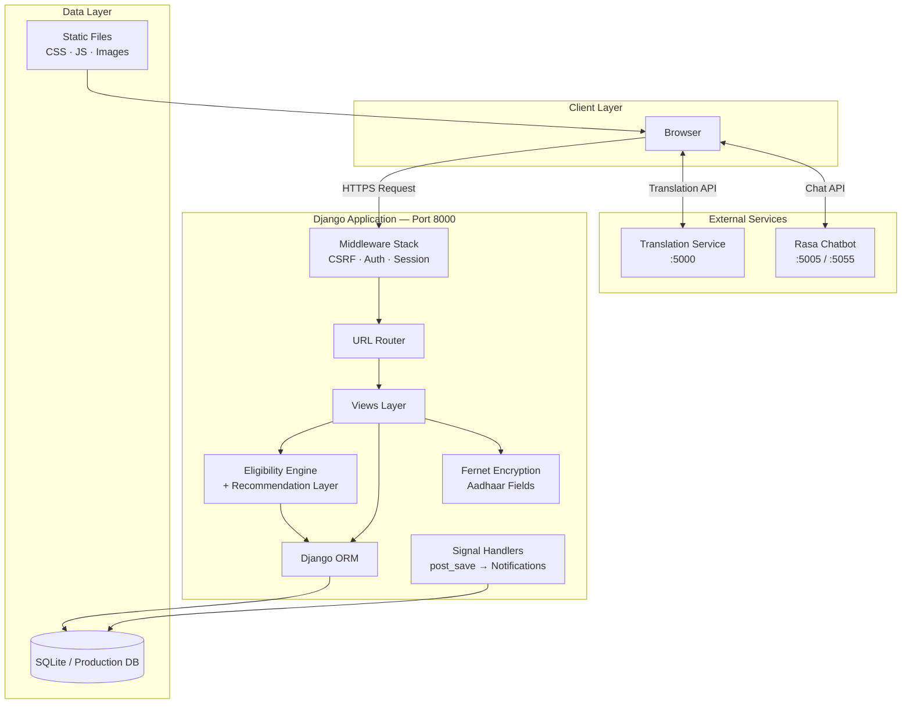
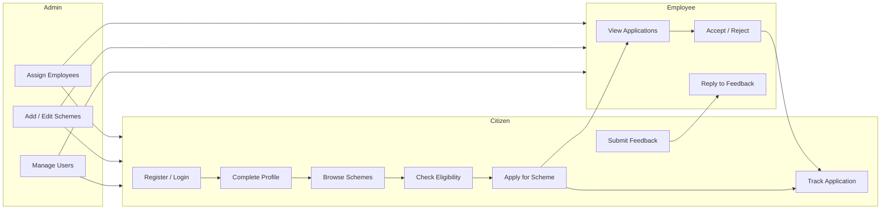
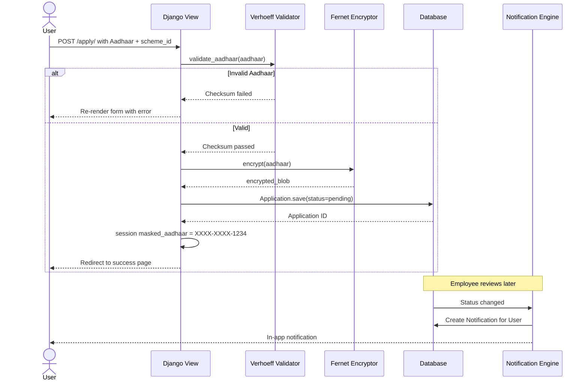
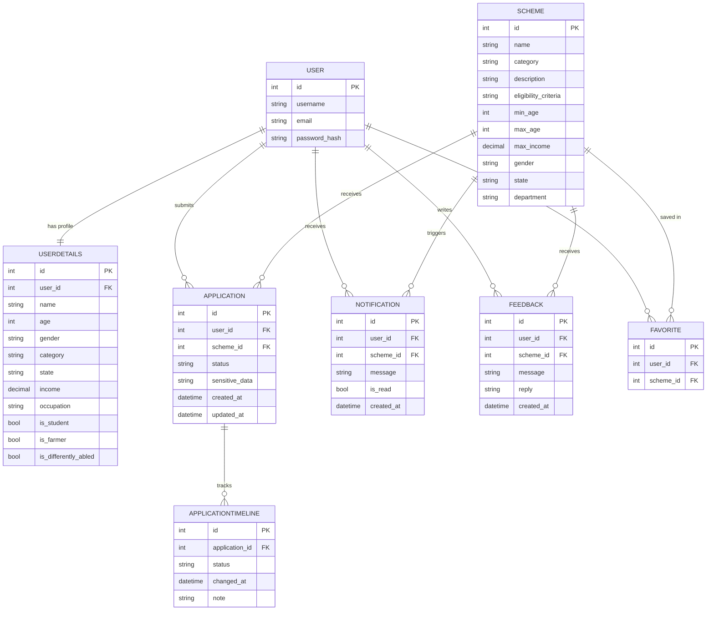
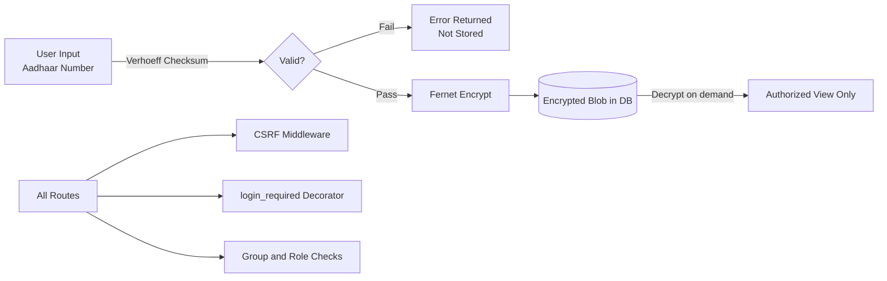
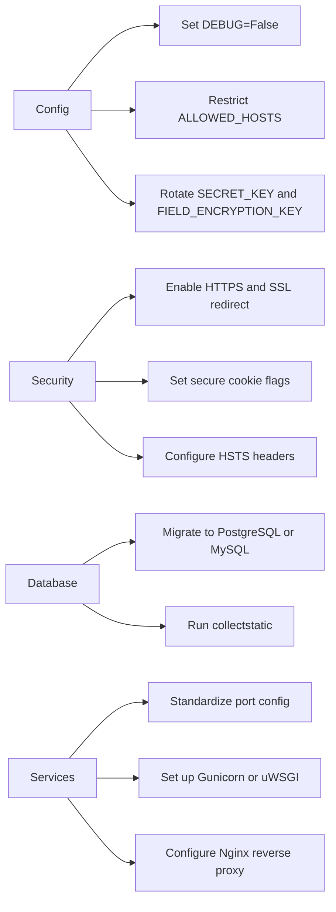

<div align="center">

# GovAid

### Government Schemes Portal — Sikkim

**Empowering citizens with seamless, secure access to government welfare schemes**

[](https://python.org)
[](https://djangoproject.com)
[](https://tailwindcss.com)
[](https://sqlite.org)
[](LICENSE)
[]()

</div>

---

## Table of Contents

- [Overview](#overview)
- [Key Features](#key-features)
- [System Architecture](#system-architecture)
- [User Role Flow](#user-role-flow)
- [Application Flow](#application-flow)
- [Data Model](#data-model)
- [Tech Stack](#tech-stack)
- [Project Structure](#project-structure)
- [Getting Started](#getting-started)
- [Environment Configuration](#environment-configuration)
- [Data Seeding](#data-seeding)
- [API Routes](#api-routes)
- [Security](#security)
- [Integrations](#integrations)
- [Quality Assurance](#quality-assurance)
- [Troubleshooting](#troubleshooting)
- [Production Checklist](#production-checklist)
- [Authors](#authors)
- [License](#license)

---

## Overview

**GovAid** is a production-grade Django web platform built for the citizens of Sikkim. It centralizes government scheme discovery, eligibility evaluation, and application submission into a single trusted portal — with role-based workflows for citizens, employees, and administrators.

> Built with security-first principles: Aadhaar inputs are Verhoeff-validated and Fernet-encrypted before storage. No plaintext sensitive data is ever persisted.

### Strategic Goals

| Goal | Description |
|------|-------------|
| **Centralize Discovery** | One place for all government schemes across departments |
| **Instant Eligibility** | Real-time per-scheme and bulk eligibility matching against user profiles |
| **Guided Applications** | Step-by-step secure application workflows with field validation |
| **Data Trust** | Encrypted sensitive fields, CSRF protection, and access-controlled views |
| **Role-Based Operations** | Separate interfaces for citizens, employees, and administrators |

---

## Key Features

<table>
<tr>
<td width="33%">

### Citizens
- Register & manage profile (`UserDetails`)
- Discover and filter schemes
- Run eligibility checks (single or all)
- Submit applications with Aadhaar validation
- Manage favourites & notifications
- Submit and track feedback

</td>
<td width="33%">

### Employees
- Review and reply to user feedback
- Process applications (`pending → accepted / rejected`)
- Trigger status-change notifications to users

</td>
<td width="33%">

### Administrators
- Full Django admin access
- Manage users, schemes, and employees
- Seed and import scheme data
- Monitor system health

</td>
</tr>
</table>

---

## System Architecture


```mermaid
graph TB
    subgraph CLIENT["Client Layer"]
        B[Browser]
    end

    subgraph DJANGO["Django Application — Port 8000"]
        direction TB
        MW[Middleware Stack<br/>CSRF · Auth · Session]
        ROUTER[URL Router]
        VIEWS[Views Layer]
        ENGINE[Eligibility Engine<br/>+ Recommendation Layer]
        ORM[Django ORM]
        SIGNALS[Signal Handlers<br/>post_save → Notifications]
        CRYPTO[Fernet Encryption<br/>Aadhaar Fields]
    end

    subgraph DATA["Data Layer"]
        DB[(SQLite / Production DB)]
        STATIC[Static Files<br/>CSS · JS · Images]
    end

    subgraph EXT["External Services"]
        TRANS[Translation Service<br/>:5000]
        RASA[Rasa Chatbot<br/>:5005 / :5055]
    end

    B -->|HTTPS Request| MW
    MW --> ROUTER
    ROUTER --> VIEWS
    VIEWS --> ENGINE
    VIEWS --> ORM
    VIEWS --> CRYPTO
    ENGINE --> ORM
    ORM --> DB
    SIGNALS --> DB
    B <-->|Translation API| TRANS
    B <-->|Chat API| RASA
    STATIC --> B
```

---

## User Role Flow


```mermaid
flowchart LR
    subgraph CITIZEN["Citizen"]
        C1[Register / Login]
        C2[Complete Profile]
        C3[Browse Schemes]
        C4[Check Eligibility]
        C5[Apply for Scheme]
        C6[Track Application]
        C7[Submit Feedback]
    end

    subgraph EMPLOYEE["Employee"]
        E1[View Applications]
        E2[Accept / Reject]
        E3[Reply to Feedback]
    end

    subgraph ADMIN["Admin"]
        A1[Manage Users]
        A2[Add / Edit Schemes]
        A3[Assign Employees]
    end

    C1 --> C2 --> C3 --> C4 --> C5 --> C6
    C5 --> E1 --> E2 --> C6
    C7 --> E3
    A1 & A2 & A3 --> EMPLOYEE & CITIZEN
```

---

## Application Flow


```mermaid
sequenceDiagram
    actor User
    participant View as Django View
    participant Val as Verhoeff Validator
    participant Enc as Fernet Encryptor
    participant DB as Database
    participant Notif as Notification Engine

    User->>View: POST /apply/ with Aadhaar + scheme_id
    View->>Val: validate_aadhaar(aadhaar)
    alt Invalid Aadhaar
        Val-->>View: Checksum failed
        View-->>User: Re-render form with error
    else Valid
        Val-->>View: Checksum passed
        View->>Enc: encrypt(aadhaar)
        Enc-->>View: encrypted_blob
        View->>DB: Application.save(status=pending)
        DB-->>View: Application ID
        View->>View: session masked_aadhaar = XXXX-XXXX-1234
        View-->>User: Redirect to success page
    end

    Note over DB,Notif: Employee reviews later
    DB->>Notif: Status changed
    Notif->>DB: Create Notification for User
    Notif-->>User: In-app notification
```

---

## Data Model


```mermaid
erDiagram
    USER {
        int id PK
        string username
        string email
        string password_hash
    }
    USERDETAILS {
        int id PK
        int user_id FK
        string name
        int age
        string gender
        string category
        string state
        decimal income
        string occupation
        bool is_student
        bool is_farmer
        bool is_differently_abled
    }
    SCHEME {
        int id PK
        string name
        string category
        string description
        string eligibility_criteria
        int min_age
        int max_age
        decimal max_income
        string gender
        string state
        string department
    }
    APPLICATION {
        int id PK
        int user_id FK
        int scheme_id FK
        string status
        string sensitive_data
        datetime created_at
        datetime updated_at
    }
    APPLICATIONTIMELINE {
        int id PK
        int application_id FK
        string status
        datetime changed_at
        string note
    }
    NOTIFICATION {
        int id PK
        int user_id FK
        int scheme_id FK
        string message
        bool is_read
        datetime created_at
    }
    FEEDBACK {
        int id PK
        int user_id FK
        int scheme_id FK
        string message
        string reply
        datetime created_at
    }
    FAVORITE {
        int id PK
        int user_id FK
        int scheme_id FK
    }

    USER ||--|| USERDETAILS : "has profile"
    USER ||--o{ APPLICATION : "submits"
    USER ||--o{ NOTIFICATION : "receives"
    USER ||--o{ FEEDBACK : "writes"
    USER ||--o{ FAVORITE : "bookmarks"
    SCHEME ||--o{ APPLICATION : "receives"
    SCHEME ||--o{ NOTIFICATION : "triggers"
    SCHEME ||--o{ FEEDBACK : "receives"
    SCHEME ||--o{ FAVORITE : "saved in"
    APPLICATION ||--o{ APPLICATIONTIMELINE : "tracks"
```

---

## Tech Stack

| Layer | Technology | Version | Role |
|-------|-----------|---------|------|
| **Runtime** | Python | 3.12+ | Application execution |
| **Framework** | Django | 5.2.1 | Routing, ORM, auth, middleware, admin |
| **Database** | SQLite | Default | Persistent domain storage |
| **UI Rendering** | Django Templates + Vanilla JS | — | Server-rendered pages + interactivity |
| **Design System** | Tailwind CSS | 3.4.1 | Utility-first styling |
| **Configuration** | python-decouple | 3.8 | `.env`-based settings |
| **Cryptography** | cryptography (Fernet) | 45.0.2 | Field-level Aadhaar encryption |
| **HTTP Client** | requests | 2.32.3 | External API calls |
| **Parsing** | beautifulsoup4 + lxml | 4.13.4 / 5.4.0 | HTML scraping support |
| **CSS Pipeline** | npm + Tailwind CLI | — | Build & watch CSS compilation |

### Dependency Groups

```
Platform Core      → Django, asgiref, sqlparse, tzdata
Security & Config  → cryptography, cffi, python-decouple
Integrations       → requests, beautifulsoup4, lxml
Frontend Pipeline  → tailwindcss (via npm)
```

> **Note:** `requirements.txt` is pinned for reproducibility. Keep local Python aligned with `Pipfile` (`3.12`) for predictable behavior.

---

## Project Structure

```
GovScheme/
├── gov_schemes/                    # Project config (settings, urls, wsgi/asgi)
│   ├── settings.py
│   ├── urls.py
│   └── wsgi.py / asgi.py
│
├── schemesapp/                     # Core application
│   ├── management/
│   │   └── commands/               # Custom management commands
│   │       ├── populate_schemes.py
│   │       ├── import_csv.py
│   │       └── update_full_descriptions.py
│   ├── migrations/                 # Database migrations
│   ├── templates/                  # App-level templates
│   ├── forms.py                    # Django forms
│   ├── models.py                   # Domain models
│   ├── urls.py                     # App URL patterns
│   └── views.py                    # Request handlers
│
├── templates/                      # Shared base templates
│   └── base.html                   # Global layout, nav, dark mode, CSS vars
│
├── static/                         # Static source files
│   ├── css/                        # Per-page CSS + output.css (Tailwind build)
│   ├── js/                         # Client-side JavaScript
│   └── images/                     # Assets and icons
│
├── staticfiles/                    # collectstatic output (production)
├── schemes_data/                   # CSV datasets for scheme import
├── manage.py
├── requirements.txt                # Pinned Python dependencies
├── package.json                    # npm scripts for Tailwind
├── run_all_servers.py              # Multi-service launcher
└── START_SERVERS.bat               # Windows startup script
```

---

## Getting Started

### Prerequisites

- Python 3.12+
- Node.js + npm
- Git

### 1. Clone the Repository

```bash
git clone <your-repository-url>
cd GovScheme
```

### 2. Create & Activate Virtual Environment

```bash
python -m venv .venv
```

**Windows (PowerShell):**
```powershell
.\.venv\Scripts\Activate.ps1
```

**macOS / Linux:**
```bash
source .venv/bin/activate
```

### 3. Install Dependencies

```bash
pip install -r requirements.txt
npm install
```

### 4. Configure Environment

Create a `.env` file in the project root (see [Environment Configuration](#environment-configuration)).

### 5. Initialize Database

```bash
python manage.py migrate
python manage.py createsuperuser
```

### 6. Build Frontend Assets

```bash
# One-time build
npm run build:css

# Development watch mode (auto-rebuild on changes)
npm run watch:css
```

### 7. Launch the Server

```bash
python manage.py runserver
```

| URL | Description |
|-----|-------------|
| http://127.0.0.1:8000/ | Main application |
| http://127.0.0.1:8000/admin/ | Django admin panel |

---

## Environment Configuration

Create a `.env` file in the project root:

```env
SECRET_KEY=replace-with-your-django-secret-key
FIELD_ENCRYPTION_KEY=replace-with-your-fernet-key
DEBUG=True
ALLOWED_HOSTS=localhost,127.0.0.1

# Optional — enable in production
SECURE_SSL_REDIRECT=False
SESSION_COOKIE_SECURE=False
CSRF_COOKIE_SECURE=False
SECURE_HSTS_SECONDS=0
SECURE_HSTS_INCLUDE_SUBDOMAINS=False
SECURE_HSTS_PRELOAD=False
```

Generate a `FIELD_ENCRYPTION_KEY`:

```bash
python -c "from cryptography.fernet import Fernet; print(Fernet.generate_key().decode())"
```

| Variable | Required | Description |
|----------|----------|-------------|
| `SECRET_KEY` | Yes | Django cryptographic key |
| `FIELD_ENCRYPTION_KEY` | Yes | Fernet key for Aadhaar field encryption |
| `DEBUG` | Yes | `True` for dev, `False` for production |
| `ALLOWED_HOSTS` | Yes | Comma-separated allowed hostnames |
| `SECURE_SSL_REDIRECT` | Optional | Enable in production with HTTPS |
| `SESSION_COOKIE_SECURE` | Optional | Enable in production |
| `CSRF_COOKIE_SECURE` | Optional | Enable in production |

---

## Data Seeding

```bash
# Seed curated in-code schemes
python manage.py populate_schemes

# Import schemes from CSV dataset
python manage.py import_csv

# Enrich long descriptions for known scheme names
python manage.py update_full_descriptions
```

---

## API Routes

| Route | Method | Access | Purpose |
|-------|--------|--------|---------|
| `/` | GET | Public | Home page |
| `/schemes/` | GET | Public | Scheme index / listing |
| `/scheme/<id>/` | GET | Public | Scheme detail view |
| `/advanced-search/` | GET | Public | Multi-criteria filtering |
| `/check-eligibility/` | GET | Auth | User-wide eligibility results |
| `/apply/` | GET, POST | Auth | Scheme application submission |
| `/applications/` | GET, POST | Employee | Application management |
| `/favorites/` | GET | Auth | User bookmarked schemes |
| `/comparison/` | GET | Public | Side-by-side scheme comparison |
| `/notifications/` | GET | Auth | Notification center |
| `/feedback/` | GET, POST | Auth | Submit feedback |
| `/feedbacks/` | GET | Employee | View & reply to feedback |
| `/userdetails/` | GET, POST | Auth | Edit user profile |
| `/admin/` | GET | Superuser | Django admin panel |

---

## Security


```mermaid
flowchart LR
    A[User Input<br/>Aadhaar Number] -->|Verhoeff Checksum| B{Valid?}
    B -->|Fail| C[Error Returned<br/>Not Stored]
    B -->|Pass| D[Fernet Encrypt]
    D --> E[(Encrypted Blob in DB)]
    E -->|Decrypt on demand| F[Authorized View Only]

    G[All Routes] --> H[CSRF Middleware]
    G --> I[login_required Decorator]
    G --> J[Group and Role Checks]
```

| Control | Implementation |
|---------|---------------|
| **Aadhaar Encryption** | `cryptography.Fernet` — field-level symmetric encryption |
| **Aadhaar Validation** | Verhoeff checksum algorithm before any persistence |
| **Access Control** | `@login_required` + Django group membership checks |
| **CSRF Protection** | Django `CsrfViewMiddleware` enabled globally |
| **Session Security** | Configurable secure cookies for production |

---

## Integrations

### Translation Service
- Endpoint: `http://localhost:5000/translate`
- Used by: `translate_page` view for in-browser language switching

### Rasa Chatbot
- Management command: `python manage.py run_rasa_server`
- Ports: `5005` (HTTP) / `5055` (action server)

### Startup Scripts

| Script | Platform | Purpose |
|--------|----------|---------|
| `run_all_servers.py` | Cross-platform | Launch Django + auxiliary services |
| `START_SERVERS.bat` | Windows | Batch launcher |
| `start_servers.sh` | macOS/Linux | Shell launcher |

> **Important:** Startup scripts contain machine-specific absolute paths (e.g., `C:\Users\...`). Update these before running on a new machine. Standardize ports `5000`, `5005`, `5055` across all scripts to avoid runtime mismatches.

---

## Quality Assurance

```bash
# Run Django system checks
python manage.py check

# Run test suite
python manage.py test

# Test auxiliary service connectivity
python test_servers.py

# Test notification system
python test_notifications.py
```

---

## Troubleshooting

| Issue | Resolution |
|-------|-----------|
| `SECRET_KEY` or `FIELD_ENCRYPTION_KEY` missing | Verify `.env` exists in project root with both keys set |
| CSS changes not reflected | Run `npm run build:css` or keep `npm run watch:css` active |
| Empty scheme list | Run `python manage.py populate_schemes` or `python manage.py import_csv` |
| Startup script failures on new machine | Replace hardcoded absolute paths with local paths |
| No eligibility results showing | Complete user profile at `/userdetails/` |
| Port conflicts | Ensure ports `8000`, `5000`, `5005`, `5055` are free |
| Translation not working | Verify translation service is running on `localhost:5000` |

---

## Production Checklist


```mermaid
graph LR
    A[Config] --> A1[Set DEBUG=False]
    A --> A2[Restrict ALLOWED_HOSTS]
    A --> A3[Rotate SECRET_KEY and FIELD_ENCRYPTION_KEY]

    B[Security] --> B1[Enable HTTPS and SSL redirect]
    B --> B2[Set secure cookie flags]
    B --> B3[Configure HSTS headers]

    C[Database] --> C1[Migrate to PostgreSQL or MySQL]
    C --> C2[Run collectstatic]

    D[Services] --> D1[Standardize port config]
    D --> D2[Set up Gunicorn or uWSGI]
    D --> D3[Configure Nginx reverse proxy]
```

| Category | Task |
|----------|------|
| **Configuration** | Set `DEBUG=False`, restrict `ALLOWED_HOSTS` |
| **Secrets** | Rotate `SECRET_KEY` and `FIELD_ENCRYPTION_KEY` |
| **Security** | Enforce HTTPS, secure cookie flags, HSTS headers |
| **Assets** | Run `python manage.py collectstatic` |
| **Database** | Replace SQLite with PostgreSQL or MySQL |
| **Services** | Standardize all bot/translation port and endpoint config |
| **Process** | Use Gunicorn or uWSGI behind Nginx |

---

## Authors

- **Vaibhav Tiwari** — [@how-vaibhav](https://github.com/how-vaibhav)
- **Akshat Agarwal** — [@Akshat774](https://github.com/Akshat774)
- **Abhigya Dulal** — [@SkylerOnRadio](https://github.com/SkylerOnRadio)

---

## License

This project is licensed under the terms described in [LICENSE](LICENSE).

---

<div align="center">

**Built for the citizens of Sikkim**

*GovAid — Bridging the gap between citizens and the benefits they deserve*

</div>
